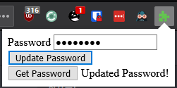
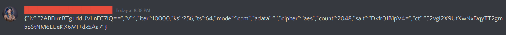
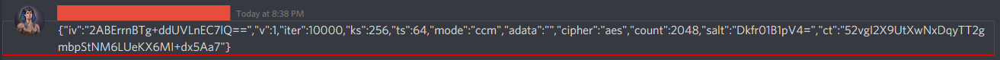

# Discrypt
 Discord Encryption in the browser.
 Open sourced and commented, uses multiple different aspects of WebExtensions.

# Screenshots
Encrypt button 

Decrypt button 

Extension popup

Encrypted message

Decrypted message

Failed to decrypt

# Credits/Licenses
* KhafraDev ("Khafra").
* DiscordJS/Amish Shah (https://github.com/discordjs/discord.js/blob/master/LICENSE)
* SJCL (https://github.com/bitwiseshiftleft/sjcl/blob/master/LICENSE.txt)
* Bootstrap SVGs (https://github.com/twbs/icons/blob/master/LICENSE.md)

# Known bugs
1. On startup you have to go to a different channel/server before buttons are added. Not really a bug since it's caused by the way I handle adding buttons.
2. Emojis are completely removed from the text.
3. Might not work on Chrome/Edge/Opera. Chrome support is likely, but it'll never be tested anywhere other than Firefox.
4. Popup looks bad because I dislike HTML and CSS very much.

# Changelog
## v1.0.0
* Initial commit.

## v1.0.1
* Better Decrypt button (looks and feels native to Discord).
* Use background script to detect page updates instead of using a keydown event.
* Use background script to change and retrieve password "safely". 
* Popup to change/get current password. 
* Better, but not great, encrypt icon.
* Completely functional, could be used on a daily basis.  

## v1.0.2
* Remove usage of ``browser`` since Firefox supports the ``chrome`` namespace. :)
* Detect if password isn't set instead of using an insecure default password.
* Password is propagated when the page loads, instead of it needing to be reset. 
* Add images to README.

## v1.0.3
* Don't alert on message send, only on failure.
* Clear the message box after sending a message.
* Better method of getting certain elements that doesn't throw errors.
* Stops password from being logged into console, after all Discord does some funky stuff with ``console``. 
* Better encrypt icon, again. Feels *almost* native, just needs to be a bit bigger.

## v1.0.4
* Less hacky way of getting token and fingerprint. Gets it from localStorage on document start instead of attaching an iframe.
* More comments!

## v1.0.5
* Fingerprint could sometimes be undefined in localStorage. Brings back the old method as a backup.
* Fix "Could not establish connection. Receiving end does not exist," by checking the status.
* Disallows encrypted messages over 2,000 characters to be sent; would cause a 401 BAD REQUEST.
* Prefix files with ``discrypt_`` to not overlap with other extensions.
* Make ``getPropertyLikeId`` more verbose; now works with any property (renamed to ``getPropertyLikeProp``).
* Remove window.onload event listener and password caching in background script.
* If a message is decrypted, press the decrypt button again to re-encrypt the contents!